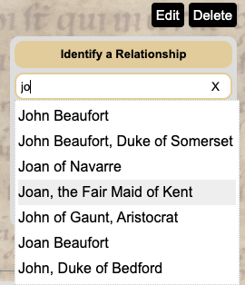

# Autocomplete Select
Autocomplete Select is a simple and lightweight JavaScript autocomplete widget.



## Installation

Install the package:
```console
npm install autocomplete-select
#or
yarn install autocomplete-select
```

Import the JS and CSS into your code:
```javascript
import autocomplete from "autocomplete-select";
import "autocomplete-select/autocomplete.css";
```
## Getting Started

At minimum, call the `autocomplete()` function with the `container` and `onInput` options. The input field will be automatically generated inside the `container` element:

```javascript

	//These are the objects from which we will choose suggestions
    const countries = [
    	{id: 1, name: "Australia"},
        {id: 2, name: "Bulgaria"},
        //...
        {id: 236, name: "Zambia"}
    ]
    
    const myContainer = document.getElementById(#my-container);
    
    autocomplete({
    	container: myContainer,
        //Filter suggestions based on user query
        onInput: (query, suggestMatches) => {
            const term = query.toLowerCase();
            const matches = countries.filter(country => {
                return ~country.toLowerCase().indexOf(term)
            })
            const formattedMatches = matches.map(match => match.name);
            //call suggestMatches callback with array of matches
        	suggestMatches(formattedMatches)
        }
    })
```

Once the user selects a suggestion, you may want access the original (unformatted) match object with the `onSelect` callback. If so, put the formatting logic in the `formatMatches` option, like so:

```javascript
	//...
	autocomplete({
    	//...
        onInput: (query, suggestMatches) => {
            const term = query.toLowerCase();
            const unformattedMatches = countries.filter(country => {
                return ~country.toLowerCase().indexOf(term)
            })
            //call suggestMatches callback with array of (unformatted) matches 
        	displayMatches(unformattedMatches)
        },
        formatMatch: (unformattedMatch) => unformattedMatch.name,
        onSelect: (selectedMatch) => {
        	//Here you can do stuff with the unformatted selectedMatch object
        },
        //...
    })
```
## Default behavior
    When the user types in the input field, a results panel containing autocomplete suggestions is generated underneath. Besides clicking, the user has the option of using the arrow and Enter keys to navigate the panel and select a suggestion. When a suggestion is selected, the input field is filled with the text of the suggestion.

## Options

You can pass the following options to `autocomplete()`

| Parameter | Type | Description |
| :-------: | :---:| ----------- |
|`container` `(Required)`|`HTMLElement`|This is the `HTMLElement` container in which the input element will be generated.|
|`onInput` `(Required)`| `Function(query, suggestMatches)`| This function is called when the user types in the input field in order to generate autocomplete suggestions. The first parameter is the current value of the input field.  The second parameter is a callback function which should be called with an array of matches to be displayed as autocomplete suggestions.|
|`formatMatch`|`Function(match)` | This function is run for every match generated by `onInput`. It should return a `String` or an `HTMLElement` which will be used as the formatted autocomplete suggestion. If this function is not provided, the `match` item itself will be used as the suggestion.|
|`clearBtnEnabled`| `Boolean`| Provides a button to the right of the input field that will clear the field. The button is only present when the input field is not empty. This option also causes the input value to revert to last selected item when the input field loses focus. The default value is `false`.|
|`onClear`|`Function`| This function will be called when the input is cleared (either with the clear button or manually with backspace) |
|`onSelect`|`Function(selectedMatch)`| This function will be called when the user selects a suggestion (either by clicking on a suggestion or by hitting the Enter key). The parameter is the match item provided by `onInput`|
|`initialValue`|`String`| Sets an autofill value for the input field. |
|`placeholder`|`String`| Sets a placeholder value for the input field.|

## CSS

The `autocomplete.css` import provides very minimal styling to position the results panel, highlight the active suggestion, etc. To add your own styling (which you will definitely want to do!), import a CSS file after this `autocomplete.css`.

#### Selectors

| Class | Element |
| :---: | ------- |
|`.autocomplete-input` | The auto-generated input element |
|`.autocomplete-results`| The div for the autocomplete suggestion panel |
| `.active` | The suggestion that is currently active  |

## License

Autocomplete Select is released under the [MIT License](https://opensource.org/licenses/MIT).
